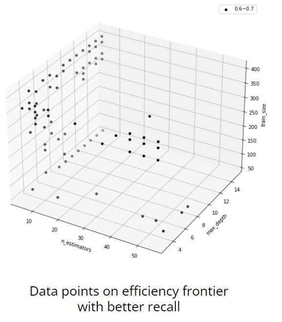

$\sqrt{3x-1}+(1+x)^2$
# Hyper-parameters Tuning Using VRS Model
### Instruction
Random forest is a widely used machine learning method for classification problems. Given a set of training data, the model constructs `n_estimators` decision tree, each of which has the depth up to `max_depth`. After fitting training data set, the model can predict the category of a sequence of feactures by the class selected by most trees.

As well known, hyper-parameters of random forest have an effect on the model's performance. Since the performance of single classifiers in forest is poor, if `n_estimators` is not large enough, the whole random forest model will have bad performance. Besides, as `max_depth` grows up, the strength of each trees grows up. However, if individual trees is too strong, inter-tree correlation will be too high, which may cause the error rate of random forest model grows up.

In addition, high `n_estimators` and `max_depth` raise the complexity of the model. Both of them can be seen as the cost of the model since it consuming more computing resource to train the model when they grow up. The size of training data is the cost of the model as well, for we have to spend more time to collect larger data set. Obviously, we prefer the model which has lower cost among the ones have the same performance. That is, the model that can get great performance at a low cost should be thought of as efficient and highly competitive. To evaluate relative efficiency of each models, we will use Data Envelopment Analysis (DEA) in our project. Usually, DEA is used to measure productivity efficiency of decision making units (DMUs), which consume multiple inputs to produce multiple outputs. In this case, each random forest models is similar to a DMU, and their inputs are the parameter set (`n_estimators`, `max_depth`, `train_size`). As for evaluating models' performance, we select `precision` and `recall` as the objectives to optimize, because accuracy can not reflect models' performance if the data set is imbalanced.

### Experiment Design
#### 1. Determine global searching space
Since production function has the property that the product DMUs get should increase as they consume more resource, we should verify the relation between our input and output meets the property to apply DEA to tuning hyper-parameter.


Take the diabetes dataset for example (see the picture above). In this dataset, each data has 8 features, and our objective is to predict whether a patient has diabetes based on these features. As you can see in the upper line chart, higher `n_estimators` stands for that we consume more computing resource. However, in the lower scatterplot, model's performance doesn't improve if `n_estimators` is larger than 60. Thus, we are able to decide the upper bound of `n_estimators`. The situation in `max_depth` and `train_size` are also the same, so we can determine our global searching space as following.

Parameter  | Upper Bound
------------- | -------------
 `n_estimators` | 60
`max_depth`  | 16
`train_size`  | 410


#### 2. Generate DMUs
Next, we sample some parameter sets at wide interval in the global searching space. In contrast, grid search we use in this project has narrow interval, which is shown as the following table.

Parameter  | DEA | Grid Search
------------- | ------------- | -------------
 `n_estimators` | 5 | 2
`max_depth`  | 1 | 1
`train_size`  | 20 | 10

After sampling the data points, we use these parameter sets to train random forest model. Then, we can use models to predict outcome of testing data sets and calculate `precision` and `recall` which form DMUs' outputs. 
#### 3. Use DEA to construct frontier
DEA was proposed for finding the relative efficiencies of DMUs. The relative efficiency of a DMU **r** is measured by finding the best weights of all inputs and outputs to maximize **r**'s efficiency. Besides, the weights should be positive, and the other DMUs' efficiency should be on the interval [0, 1].

Let there be K DMUs. Each DMU<sub>r</sub> consumes I inputs say x<sub>r1</sup></sub>, x<sub>r2</sup></sub>,..., x<sub>rI</sup></sub> and produces J outputs say y<sub>r1</sup></sub>, y<sub>r2</sup></sub>,..., y<sub>rJ</sup></sub>. Let v<sub>1</sup></sub>, v<sub>2</sup></sub>,...,v<sub>I</sup></sub> be the weights associated with the inputs and u<sub>1</sup></sub>, u<sub>2</sup></sub>,..., u<sub>J</sup></sub> be the weights associated with the outputs. In the Banker, Charnes, Cooper's VRS model, the objective is to maximize the ratio of output to input as given below:

$$ Max \quad \frac{\sum_{j=1}^J u_j y_{rj}-u_0}{\sum_{i=1}^I v_jx_{ri}} $$

```math
s.t.
\quad
\left( \frac{\sum_{j=1}^Ju_jy_{kj}-u_0}{\sum_{i=1}^Iv_jx_{ki}} \right)
\leq 1
, \quad k=1,2,...,K
```
```math
u_j
\geq 0
, \quad j=1,2,...,J
```
```math
v_i
\geq 0
, \quad i=1,2,...,I
```
<center>$$u_0$$is free variable</center>
By employing VRS model on our DMUs, we can separate efficient parameters sets from others and construct efficiency frontier accordingly.
#### 4. Find the interval best parameters set lies in
DMU consuming little inputs and producing little outputs may also stand on the efficiency frontier, but it won't fulfill our task for its poor performance. As a result, DMUs on the frontier are required a certain level of performance. In the diabetes dataset, there are 36 remaining DMUs after filtering them by recall.

#### 5. Tune hyper-parameters inside the interval
We use grid search to look for the best parameters set on the interval found in the previous step. After that, optimal parameters set in our searching space can be decided.
#### 6. Compare with traditional tuning method